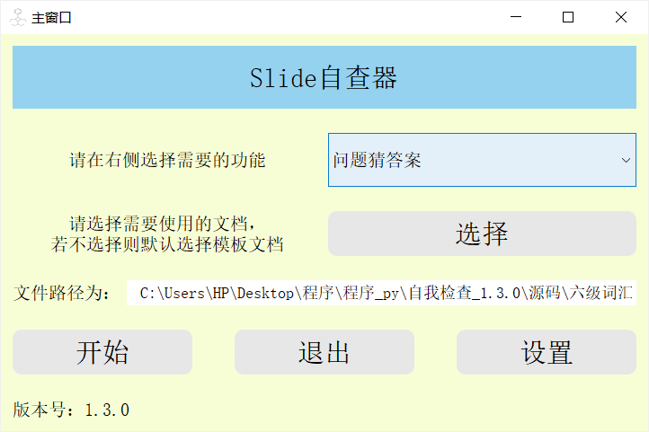
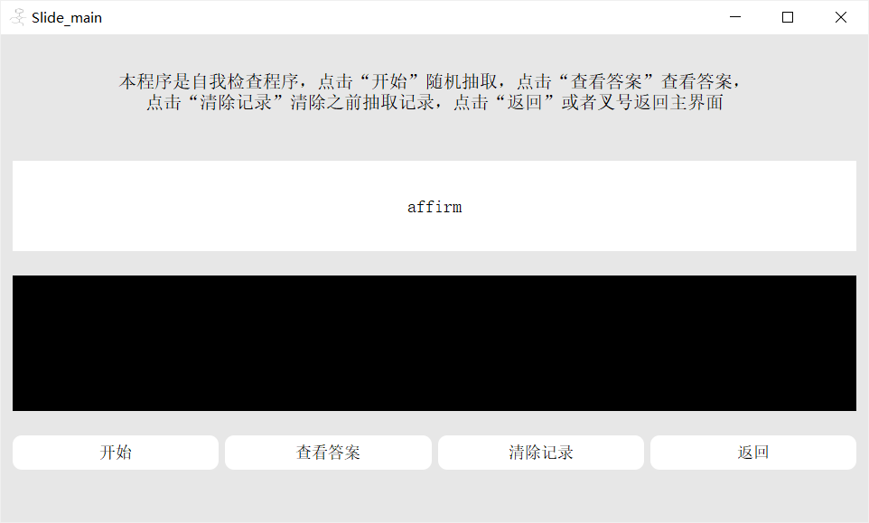
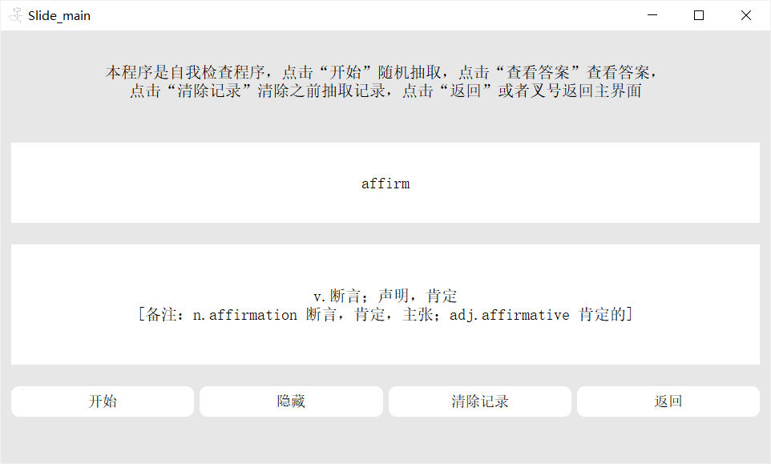
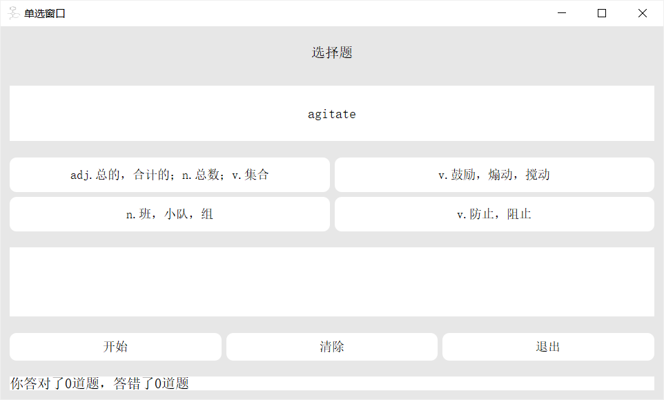
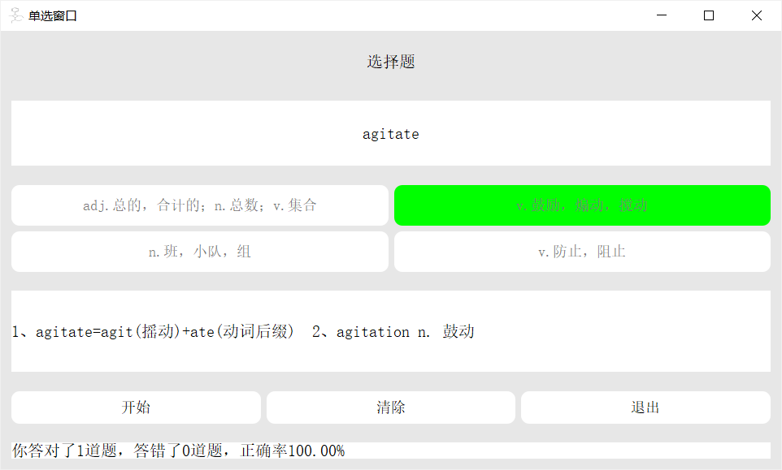
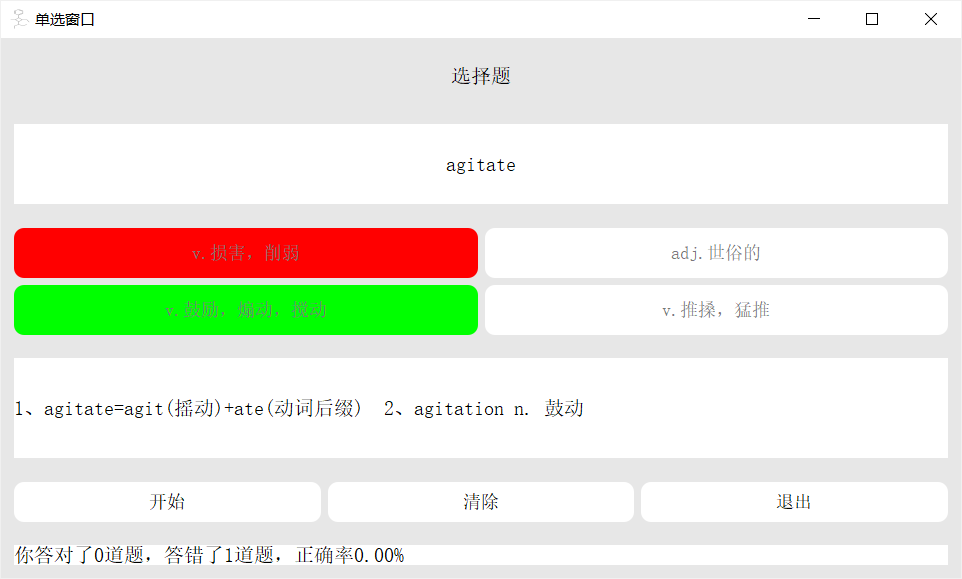
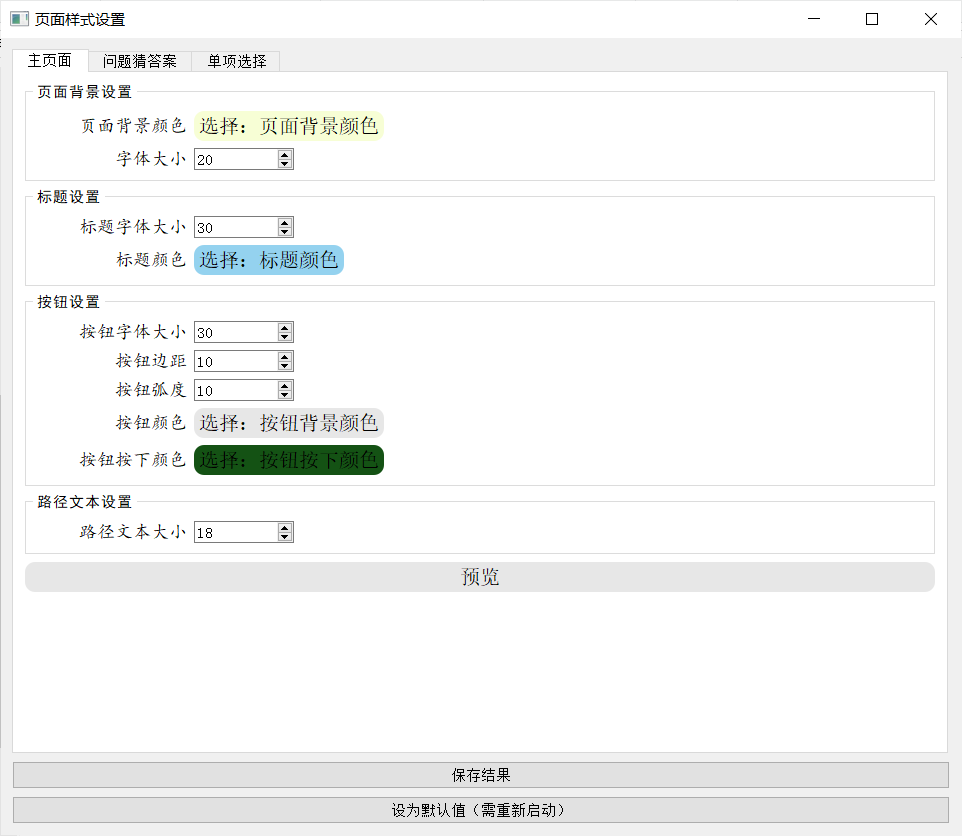
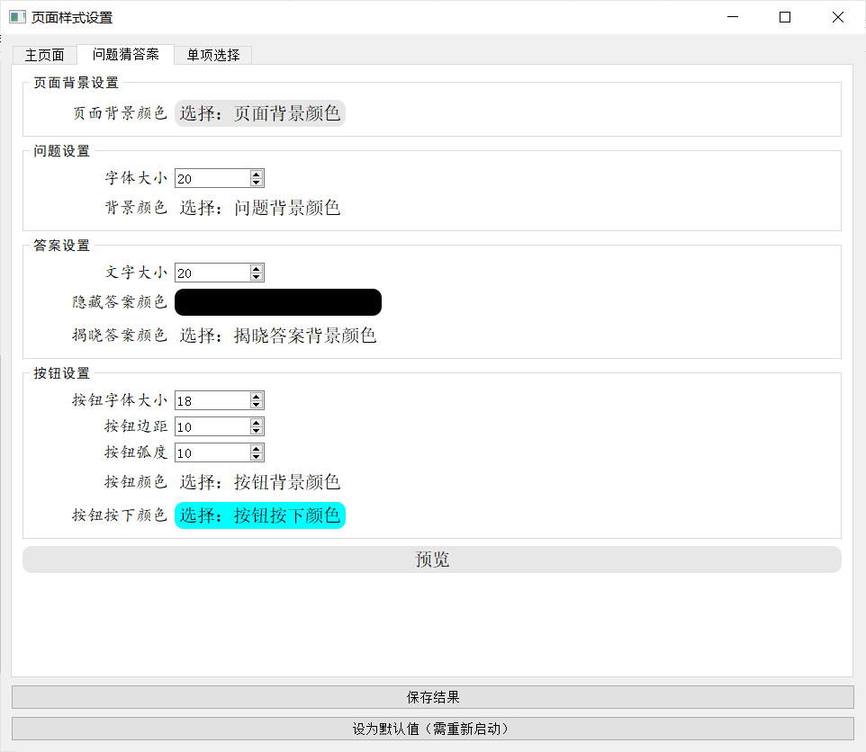
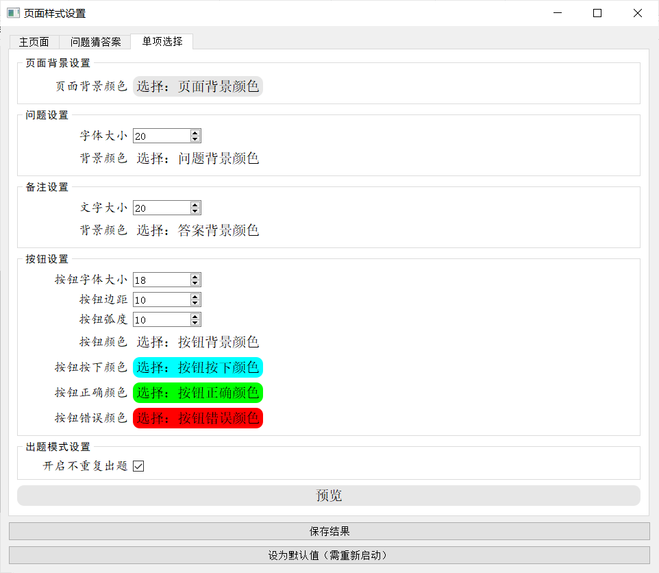

# 自我检查（自定义背单词软件）

## 0、使用方法
（1）exe格式（已打包好，见dist文件夹下）
（2）py格式：直接git-clone
## 1、页面说明

### 主页面
进入程序展示主界面。点击“选择”选择.xlsx或者.csv格式文件，文件格式参见[第二章](#2文件要求)；点击下拉选项栏选择模式，包含“问题猜答案”与“单项选择”两项；点击“开始”根据下拉菜单栏内模式跳转；点击“设置”跳转到设置页面。页面颜色等均可在设置页面调整


### slide界面
进入界面之后，点击“开始”随机抽取词库并且展示在白框内，同时答案展示在黑框内：

点击“查看答案”展示答案和备注，同时可继续点击“隐藏”隐藏答案。点击“清除记录”清除之前记录。点击“返回”或者点击“×”返回主界面。当词库抽取完全时弹出弹窗提示重新开始。


### 单选界面
进入界面之后，点击“开始”随机抽取词库并且展示在白框内，同时下方有四个按钮，点击按钮选择正确答案。

如果选择正确答案，则按钮变成绿色，正确加一

如果选择错误答案，则按钮变成红色，同时正确答案按钮变成绿色，错误加一

出题模式默认为不重复出题，若更改成重复出题，可在设置界面取消勾选。点击“清除”清除记录，点击“退出”或者“×”返回主界面。当词库抽取完全时弹出弹窗提示重新开始。

### 设置界面
|主页面|slide页面|单选页面|
|---|---|---|
||||

在设置页面可分别设置各项样式，点击“预览”可预览设置页面，点击“保存结果”可保存结果，点击“设为默认值”可恢复默认设置。

## 2、文件格式要求
文件为Excel文件或者CSV文件，文件模板为三列，第一栏为展示栏，第二栏为答案栏，第三栏为备注栏。例如：
|具体事项|答案|备注|
|---|------|--------|
|shove|v.推搡，猛推|e.g. The crowd was pushing and shoving to get a better view.
|deplore|v.谴责，悲悼，痛惜|"de"意为“向下”,"plore"为“哭泣”, 类似的还有implore v.乞求、explore v.探索
|affirm|v.断言；声明，肯定|n.affirmation 断言，肯定，主张；adj.affirmative 肯定的
|doze|v.打瞌睡，打盹|sleep、doze、nap、snooze
|impair|v.损害，削弱|"im"为"进入,使",“pair”缩写自 pejorative,为"更坏的,贬低的"|

后续会在读取文件时进行检查，敬请期待

## 3、所用仓库
```python
python === 3.9
PyQt5 === 5.19.5
openpyxl === 3.1.2
```

## 4、下版本待升级
1. 读取文件时检查格式
2. Slide界面添加重复展示
3. 打包exe缩小尺寸
4. 添加大语言模型(Large Language Model, LLM)，调用api设计提示词进行辅助学习（有这个想法，待实践）
5. 完善词汇库，之后可能会上线于某一位置
6. 待开发小程序端及网页端（有这个想法，待实践）
7. ……

## 5、比上版本改进之处
1. 重构布局，替换之前的固定格式
2. 添加设置窗口，自定义部分组件样式
3. 支持csv文件格式
4. 重构代码，修复之前bug

## 6、说明
有任何问题，可联系1648633668@qq.com
